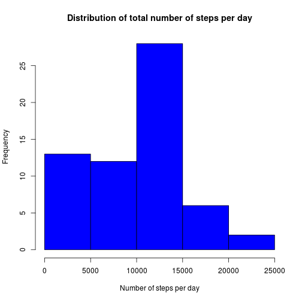
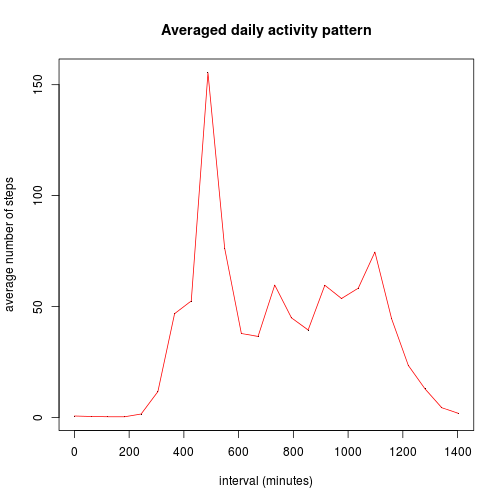
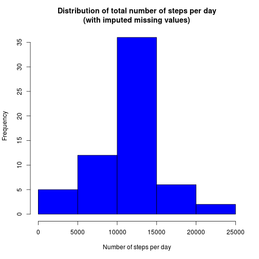
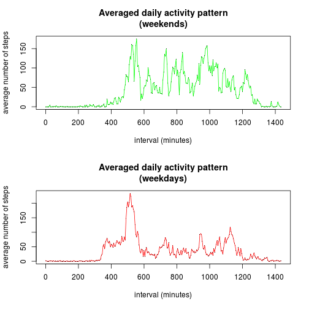

# Reproducible Research: Peer Assessment 1

## Loading and preprocessing the data


```r
activity <- read.csv("./activity.csv")
```


After loading the data I will convert the `interval` variable to a more
suitable format. The variable in the dataset is represented as hour times
one hundred, plus the number of minutes, which makes for unnatural breaks in
the data. I simply convert `interval` to the number of minutes since
midnight.


```r
activity$interval <- (activity$interval%/%100) * 60 + (activity$interval%%100)
```


## What is mean total number of steps taken per day?

To compute daily step totals sensibly I need to drop missing values.


```r
steps.by.day <- with(activity, by(steps, date, sum, na.rm = T))
```


Here's the frequency distribution of daily step totals:


```r
hist(steps.by.day, col = "blue", xlab = "Number of steps per day", main = "Distribution of total number of steps per day")
```

 


The mean and the median are easy to compute:


```r
mean(steps.by.day)
```

```
## [1] 9354
```

```r
median(steps.by.day)
```

```
## 2012-10-20 
##      10395
```


So mean total number of steps per day is 9354, while median is 10395,
indicating that the distribution is left-skewed, which is confirmed by the
histogram.

## What is the average daily activity pattern?

Once again, missing values need to be dropped to produce sensible aggregates.


```r
steps.by.interval <- with(activity, by(steps, interval, mean, na.rm = T))
```


The averaged daily activity pattern looks like this:


```r
plot(names(steps.by.interval), steps.by.interval, main = "Averaged daily activity pattern", 
    xlab = "interval (minutes)", ylab = "average number of steps", pch = ".")
lines(names(steps.by.interval), steps.by.interval, col = "red")
```

 


There's an easily identifiable peak, which can be found as follows:


```r
max(steps.by.interval)
```

```
## [1] 206.2
```

```r
which.max(steps.by.interval)
```

```
## 515 
## 104
```


So the maximum average number of steps in a five minute interval is 206.2,
and the peak occurs 515 minutes after the midnight (which corresponds to
8:35am).

## Imputing missing values

The total number of missing values in the data set is:


```r
sum(is.na(activity$steps))
```

```
## [1] 2304
```


I will replace the missing values with averages for the corresponding time
intervals.


```r
na.indices <- which(is.na(activity$steps))
activity.imputed <- activity
for (ix in na.indices) {
    activity.imputed[ix, ]$steps <- as.list(steps.by.interval)[[as.character(activity[ix, 
        ]$interval)]]
}
```


Here's how the total number of steps per day distribution looks after
extrapolation. Notably, this looks much closer to normal.


```r
steps.by.day.imputed <- with(activity.imputed, by(steps, date, sum))
hist(steps.by.day.imputed, col = "blue", xlab = "Number of steps per day", main = "Distribution of total number of steps per day\n(with imputed missing values)")
```

 


The mean and median of 10766 indicate that the skew arising due to missing
values is gone. Of course, since I replaced the values that were treated,
effectively, as zeroes with positive values, both the mean and the median are
higher now.


```r
mean(steps.by.day.imputed)
```

```
## [1] 10766
```

```r
median(steps.by.day.imputed)
```

```
## 2012-11-04 
##      10766
```


## Are there differences in activity patterns between weekdays and weekends?

After adding the indicator variable for weekdays/weekends to the dataset...


```r
activity$weekday <- as.factor(sapply(activity$date, function(x) {
    if (weekdays(as.Date(x)) %in% c("Saturday", "Sunday")) {
        "weekend"
    } else {
        "weekday"
    }
}))
```


...I can proceed with plotting separate average activity patterns for those
two categories.


```r
par(mfcol = c(2, 1))
steps.by.interval.we <- with(activity[activity$weekday == "weekend", ], by(steps, 
    interval, mean, na.rm = T))
plot(names(steps.by.interval.we), steps.by.interval.we, main = "Averaged daily activity pattern\n(weekends)", 
    xlab = "interval (minutes)", ylab = "average number of steps", pch = ".")
lines(names(steps.by.interval.we), steps.by.interval.we, col = "green")
steps.by.interval.wd <- with(activity[activity$weekday == "weekday", ], by(steps, 
    interval, mean, na.rm = T))
plot(names(steps.by.interval.wd), steps.by.interval.wd, main = "Averaged daily activity pattern\n(weekdays)", 
    xlab = "interval (minutes)", ylab = "average number of steps", pch = ".")
lines(names(steps.by.interval.wd), steps.by.interval.wd, col = "red")
```

 


The pattern look a little different, with more, and more variable, activity
on weekend. It seems that the entire plot is shifted to the right, as well,
probably indicating the person waking up and going to sleep later during
weekends.
