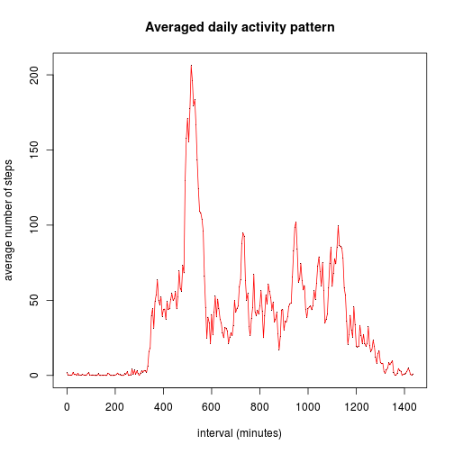
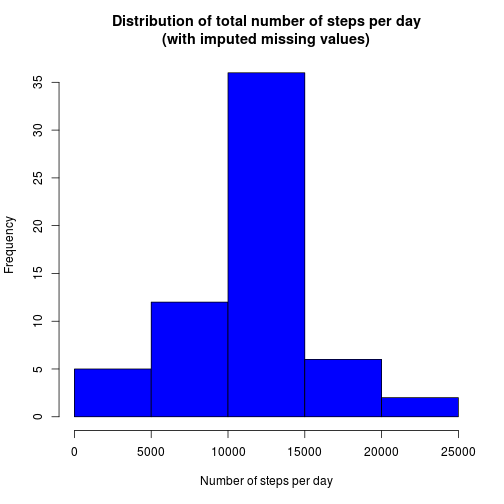

# Reproducible Research: Peer Assessment 1

## Loading and preprocessing the data


```r
activity <- read.csv("./activity.csv")
```


```r
activity$interval <- (activity$interval%/%100) * 60 + (activity$interval%%100)
```


```r
head(activity)
```

```
##   steps       date interval
## 1    NA 2012-10-01        0
## 2    NA 2012-10-01        5
## 3    NA 2012-10-01       10
## 4    NA 2012-10-01       15
## 5    NA 2012-10-01       20
## 6    NA 2012-10-01       25
```

```r
tail(activity)
```

```
##       steps       date interval
## 17563    NA 2012-11-30     1410
## 17564    NA 2012-11-30     1415
## 17565    NA 2012-11-30     1420
## 17566    NA 2012-11-30     1425
## 17567    NA 2012-11-30     1430
## 17568    NA 2012-11-30     1435
```


## What is mean total number of steps taken per day?


```r
steps.by.day <- with(activity, by(steps, date, sum, na.rm = T))
```


```r
hist(steps.by.day, col = "blue", xlab = "Number of steps per day", main = "Distribution of total number of steps per day")
```

 


```r
mean(steps.by.day)
```

```
## [1] 9354
```

```r
median(steps.by.day)
```

```
## 2012-10-20 
##      10395
```


## What is the average daily activity pattern?


```r
steps.by.interval <- with(activity, by(steps, interval, mean, na.rm = T))
```


```r
plot(names(steps.by.interval), steps.by.interval, main = "Averaged daily activity pattern", 
    xlab = "interval (minutes)", ylab = "average number of steps", pch = ".")
lines(names(steps.by.interval), steps.by.interval, col = "red")
```

 


```r
max(steps.by.interval)
```

```
## [1] 206.2
```

```r
which.max(steps.by.interval)
```

```
## 515 
## 104
```


## Imputing missing values


```r
sum(is.na(activity$steps))
```

```
## [1] 2304
```


```r
na.indices <- which(is.na(activity$steps))
activity.imputed <- activity
for (ix in na.indices) {
    activity.imputed[ix, ]$steps <- as.list(steps.by.interval)[[as.character(activity[ix, 
        ]$interval)]]
}
sum(is.na(activity.imputed$steps))
```

```
## [1] 0
```


```r
head(activity.imputed)
```

```
##     steps       date interval
## 1 1.71698 2012-10-01        0
## 2 0.33962 2012-10-01        5
## 3 0.13208 2012-10-01       10
## 4 0.15094 2012-10-01       15
## 5 0.07547 2012-10-01       20
## 6 2.09434 2012-10-01       25
```

```r
steps.by.day.imputed <- with(activity.imputed, by(steps, date, sum))
```


```r
hist(steps.by.day.imputed, col = "blue", xlab = "Number of steps per day", main = "Distribution of total number of steps per day\n(with imputed missing values)")
```

 


```r
mean(steps.by.day.imputed)
```

```
## [1] 10766
```

```r
median(steps.by.day.imputed)
```

```
## 2012-11-04 
##      10766
```


## Are there differences in activity patterns between weekdays and weekends?
